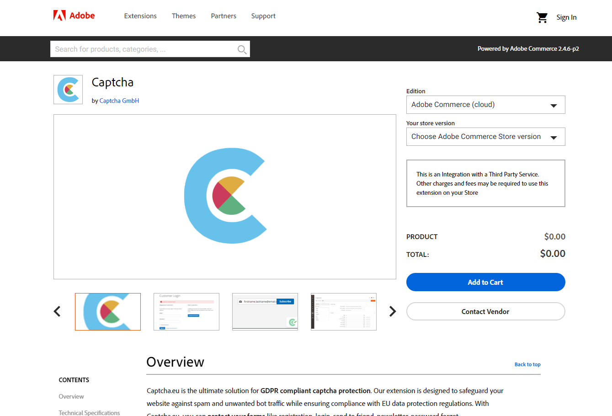
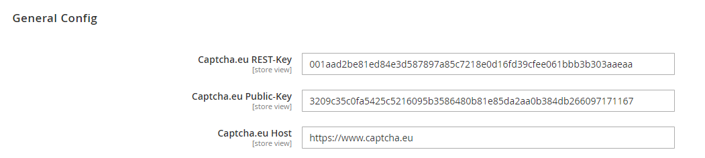

# Adobe Commerce / Magento 2

We provide a ready to use plugin for contact forms and signups inside your Adobe Commerce or Magento 2 installation.<br />

In order to enable captcha.eu on your Adobe Commerce or Magento 2 installation, follow these steps:

See also:
 - https://experienceleague.adobe.com/docs/commerce-cloud-service/user-guide/configure-store/extensions.html

## Download the extension

Download the latest version of the plugin at the Commerce Marketplace: <a href='https://commercemarketplace.adobe.com/captcha-eu-magento.html'>Captcha.eu</a>



## Install the extension

### Install with Composer

```bash
composer require captcha-eu/magento:1.0.0 --no-update
```

### Check Module Status

```bash
bin/magento module:status CaptchaEU_Captcha
```

### Enable/Disable Module

```bash
# enable
bin/magento module:enable CaptchaEU_Captcha

# disable
bin/magento module:disable CaptchaEU_Captcha
```

## Signup at captcha.eu
Go to www.captcha.eu/login and signup, your first **100 validations** are **free**.<br />
After signup go to `domains`  and add a new domain.

When done, you&apos;ll get the Rest-Key and Public Key, head back to your Adobe Commerce or Magento 2 admin interface.

## Add Keys

Open your Adobe Commerce or Magento 2 Admin Interface, go to `Stores->Configuration->Captcha.eu`.



You can enable/disable the areas that you want to protect using Captcha.eu.


## Installation Guide PDF

 - [Captcha.eu Captcha - Magento 2 Extension v1.0.0.pdf](https://docs.captcha.eu/files/adobe-commerce-magento/Captcha.eu-Captcha-Magento2-Extension-v1.0.0.pdf)
