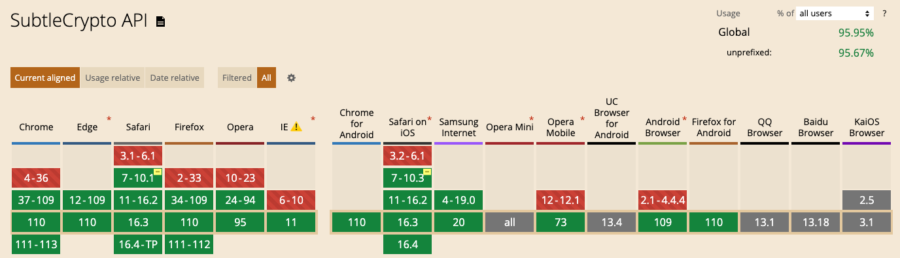

# Requirements
In order to be able to calculate a valid solution the client needs to support the following minimum requirements:
  - `>=`IE11 (but that tends to be very slow, and it is ultimatly dead, see [wired.com](https://www.wired.com/story/microsoft-internet-explorer-is-finally-really-fully-dead/) )
  - `SubtleCrypto` API  (see detailed breakdown: [caniuse.com/](https://caniuse.com/?search=SubtleCrypto))
    - https domain

