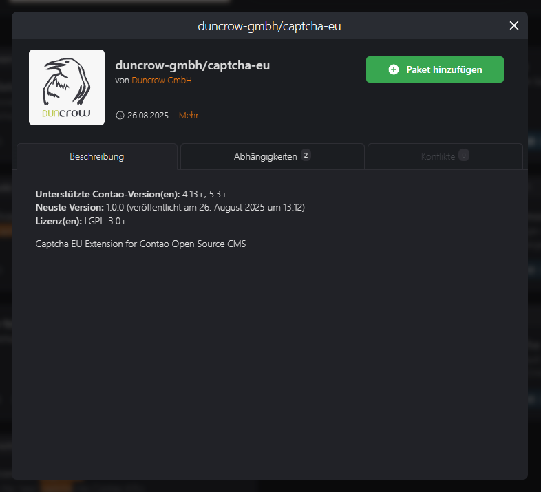
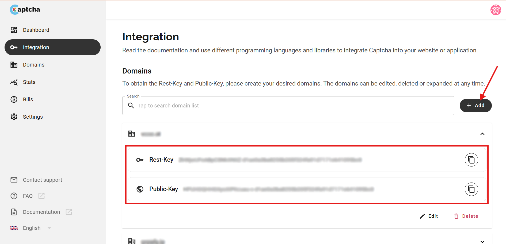
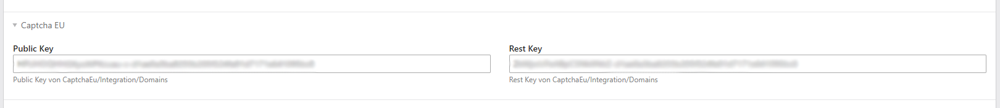
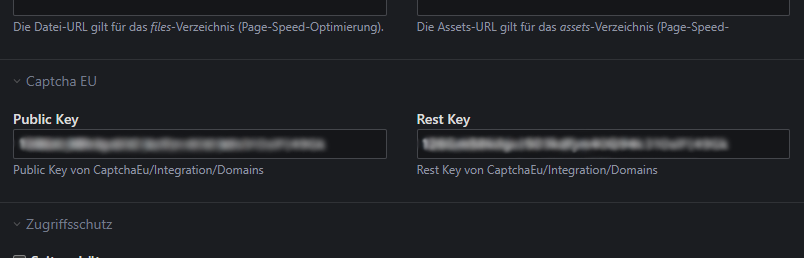
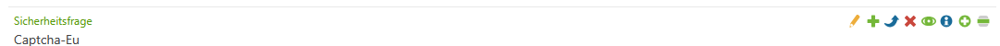
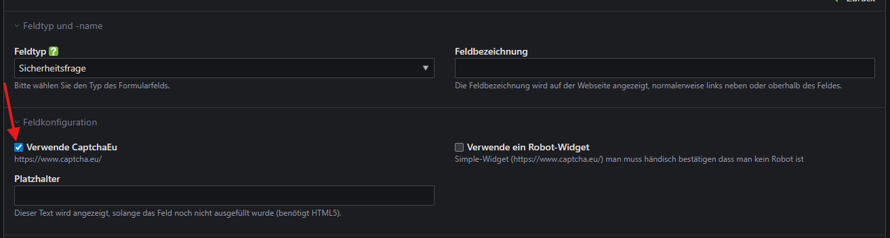

# Contao

> This extension is developed and maintained by [Duncrow](https://duncrow.com/)

## Install the extension

### Install with Composer

```bash
composer require duncrow-gmbh/captcha-eu
```

### Install via Contao Manager

Add the plugin via the Contao Manager by searching for `duncrow-gmbh/captcha-eu`.



## Signup at captcha.eu

Go to www.captcha.eu/login and signup, your first **100 validations** are **free**.<br />
After signup go to `Integration` and add a new domain.



When done, you'll get the Rest-Key and Public Key, head back to your Contao admin interface.

## Add Keys

### For Contao 5

Switch to the page structure via the 'Content' tab. Open the page settings for the page you have selected as the starting point for the website. There you will find the settings for Captcha EU.

Insert your Rest-Key and your Public-Key here.



### For Contao 4

Switch to the page structure via the 'Layout' tab. Open the page settings for the page you have selected as the starting point for the website. Here you will find the settings for Captcha EU.

Insert your Rest-Key and your Public-Key here.



## Set up your form with Captcha.eu

You can edit the desired form via the 'Forms' tab by clicking on the 'Edit form' icon. Now add a field of the type 'Security question' to the form.

Open the field configuration and tick the 'Use CaptchaEu' checkbox. This will protect your form with Captcha.eu.

If you prefer visual validation, you can activate the widget by ticking the 'Use a robot widget' checkbox.



