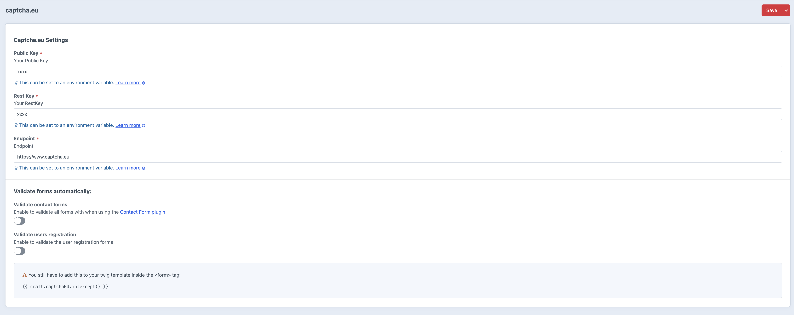

# Captcha.eu integration for CraftCMS


## Installation

Install either via plugin store or via composer

```bash
composer require captcha-eu/craftcms
./craft plugin/install captcha-eu
```

## Configuration
You need to add your Public Key (`publicKey`) and Rest Key (`restKey`) from you Captcha.eu account.

go to `/admin/settings/plugins/captcha-eu`  of your installation and configure it.




> In production environment we strictly recommend to use environment variables to set the  values.


# Template

Make Sure to include

```twig
{{ craft.captchaEU.intercept() }}
```

inside your `<form>` tag.


#  Formie

we support formie out of the box, just go to your settings
`/admin/formie/settings/captchas#tab-FormieCaptchaEU`

and enable captcha.eu - also add the key pair.
just like any other captcha used in formie, you can change it's behaviour 
on the "integration" settings of formie.