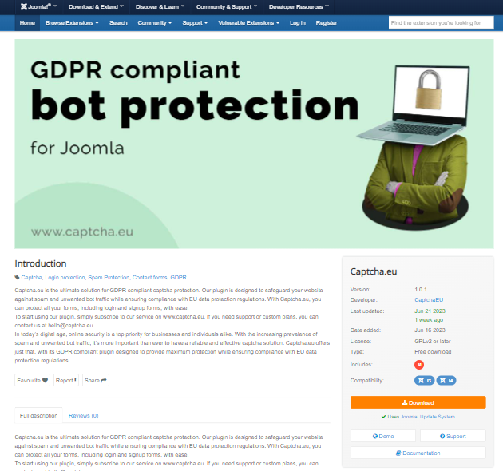
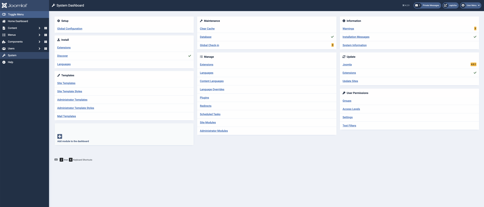
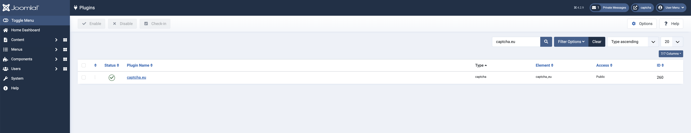
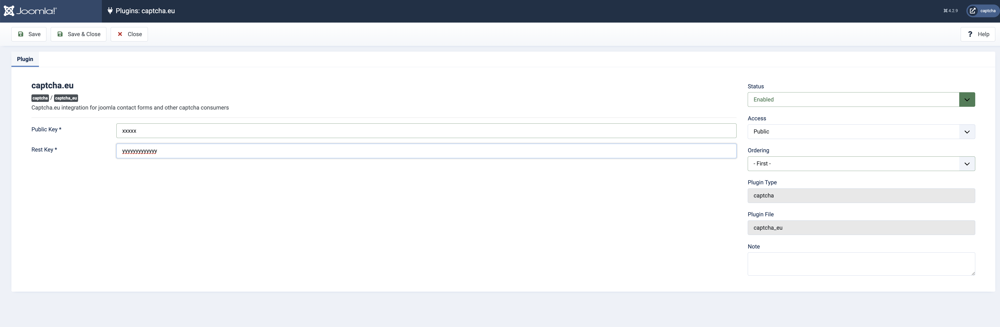
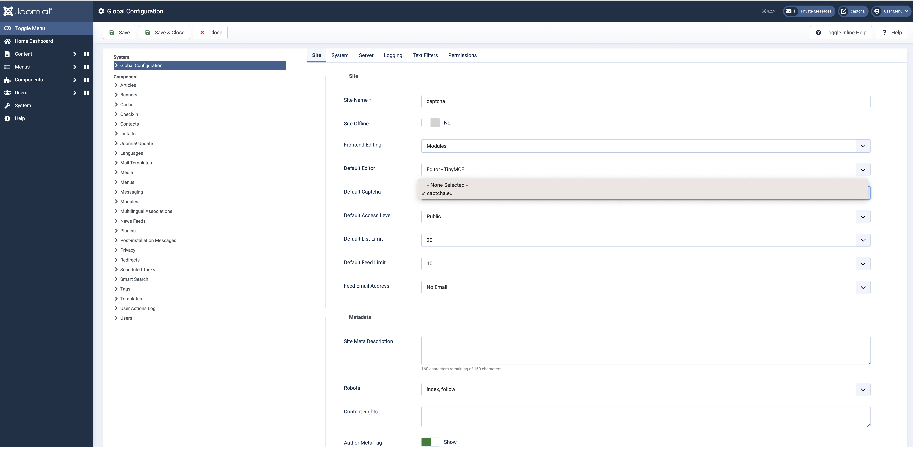
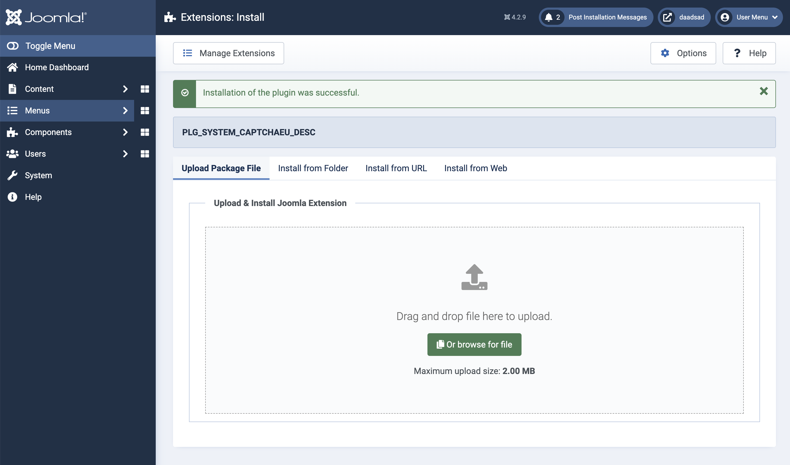
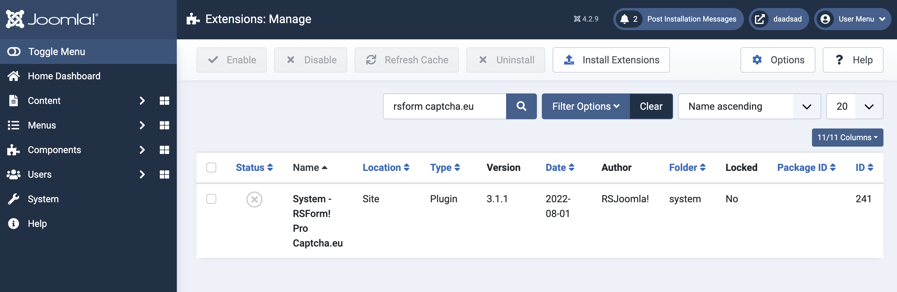
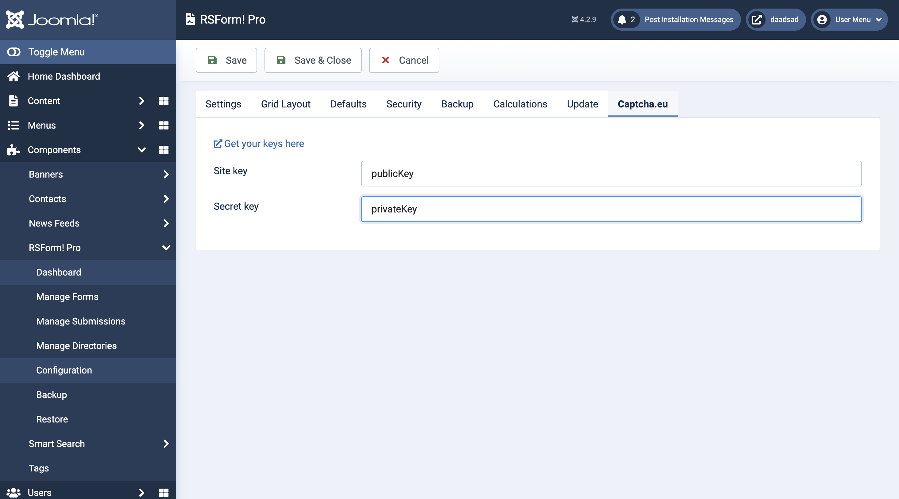
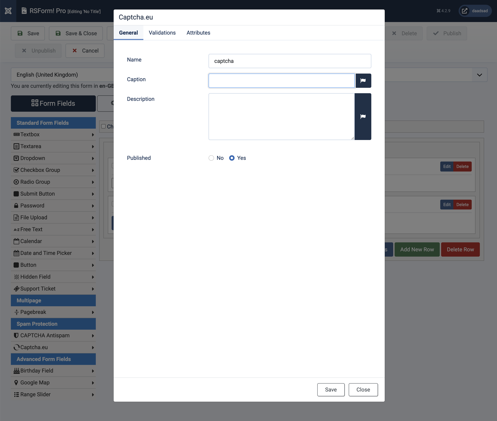

# Joomla

We provide a ready to use plugin for contact forms and signups inside your joomla installation. 
> The plugin is beta, we are happy to get feedback using one of our contact channels (hello@captcha.eu, website-chat)

In order to enable captcha.eu on your joomla installation follow these steps:

## Download the Extension

Download the latest version of the plugin at the Joomla Extension Directory: <a href='https://extensions.joomla.org/extension/access-a-security/captcha-eu/'>captcha-eu</a>

## Upload/Enable the extension
Open your joomla admin interface, go to `System->Install->Extensions`

Upload the previously downloaded `captcha_eu-latest.zip`</a> file and enable the extension.

## Signup at captcha.eu
Go to www.captcha.eu/login and signup, your first **100 validations** are **free**. 
After signup go to `domains`  and add a new domain.

When done, you&apos;ll get the Rest-Key and Public Key, head back to your joomla admin interface.

## Add Keys

Go to `System->Plugins->Captcha.eu` copy & paste the keys from captcha.eu dashboard to joomla plugin settings.

In case of a typo or if you entered the wrong key(s), you will be noticed right away on the same page.

## Enable on Joomla parts

Currently you can enable captcha.eu on:

  - Contact Forms
  - Signup's

You can configure the default captcha under: `System->Global Configuration->Global Configuration->Default Captcha` - this is used for various areas like signup and so on.

To enable it on contact forms, go to `System->Global Configuration->Contacts->Forms`  and select the captcha.eu

## RSForms! **beta**
> this is a beta plugin, we are happy to receive feedback -> hello@captcha.eu

download the zip ball <a href='files/joomla/rsfpcaptchaeu.zip'>here</a>

Install the zip  in the `System->Extensions->Install`

Enable the RSForms! Captcha.eu extension

configure the Extension

add a field to your RSForm! Form
*caption and description should be empty*

No go to your frontend and see captcha.eu in action on your form

