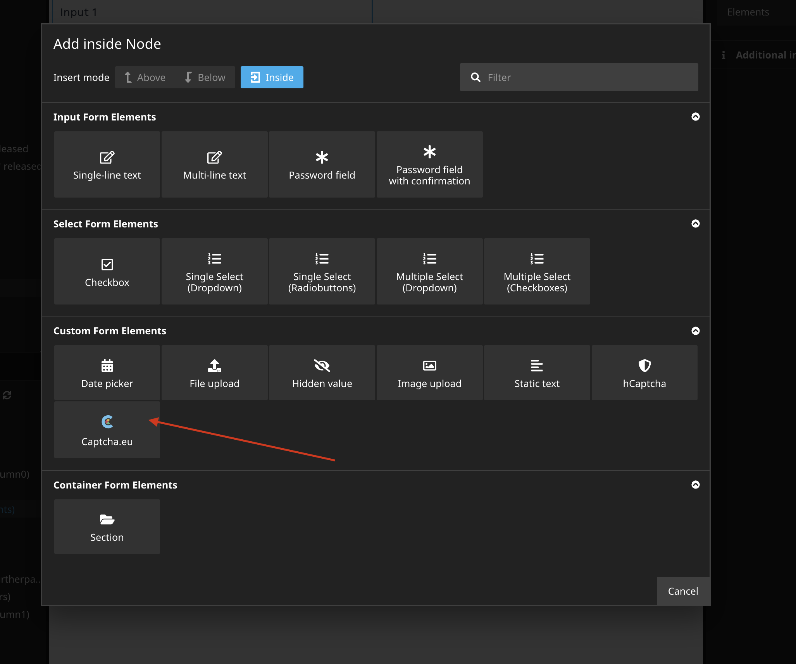

# Captcha.eu integration for Neos Form Framework


## Installation

The package can be installed via Composer.

```bash
$ composer require captcha-eu/neos
```

## Configuration
You need to add your Public Key (`publicKey`) and Rest Key (`restKey`) from you Captcha.eu account. Please have a look at the official [Captcha.eu-Docs](https://docs.captcha.eu) if you need more informations.

```yaml
CaptchaEU:
  CaptchaEU:
    publicKey: 'add-you-site-key'
    restKey: 'add-you-secret-key'
```

In production environment we strictly recommend to use environment variables to set the values.

## Add form element with Neos.Form.Builder

Create a new form in Neos backend. Add the new Captcha.eu form element to you form.




## Usage with   [Neos.Form](https://github.com/neos/form)

Simply add the new form element to your form definition renderables:

```yaml
type: 'Neos.Form:Form'
identifier: someIdentifier
label: Label
renderables:
  -
    type: 'Neos.Form:Page'
    identifier: page-one
    renderables:
      -
        type: 'CaptchaEU.CaptchaEU:Captcha'
        identifier: captcha
        label: Captcha
        properties:
          publicKey: your-public-key
          restKey: your-private-key
finishers:
  -
   <Your finishers here>
```


## Override Settings

You can override the following configurations in the node properties:

* Public Key
* Rest Key

