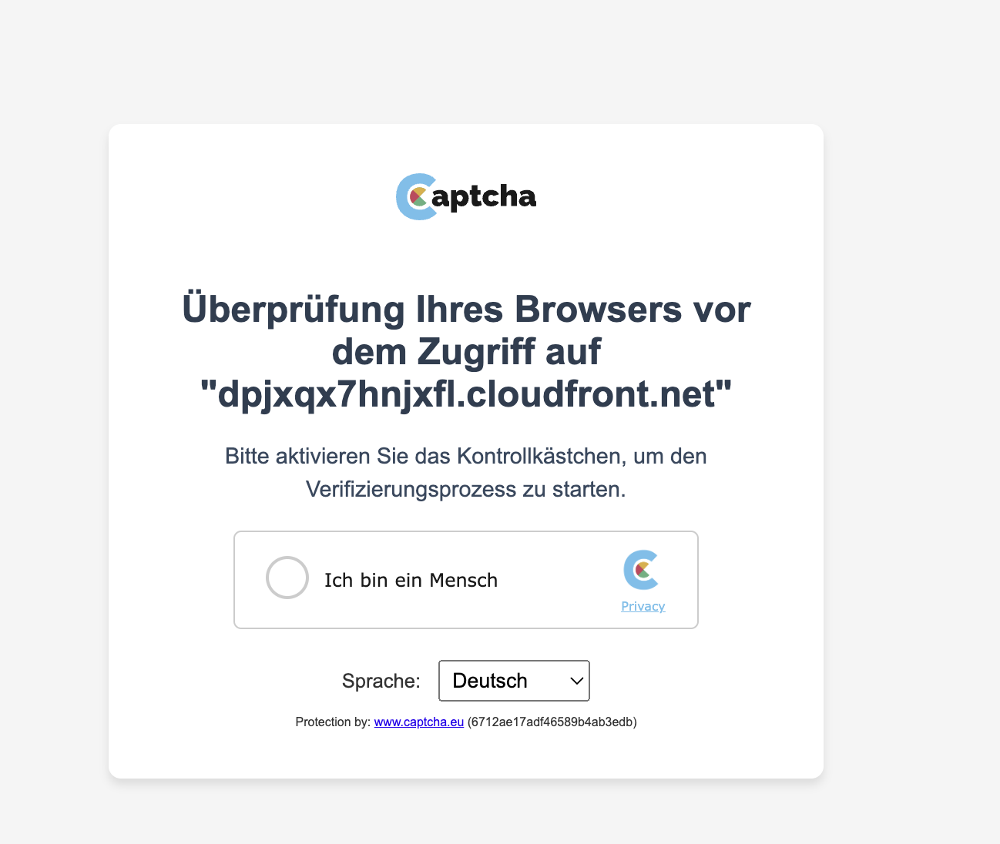
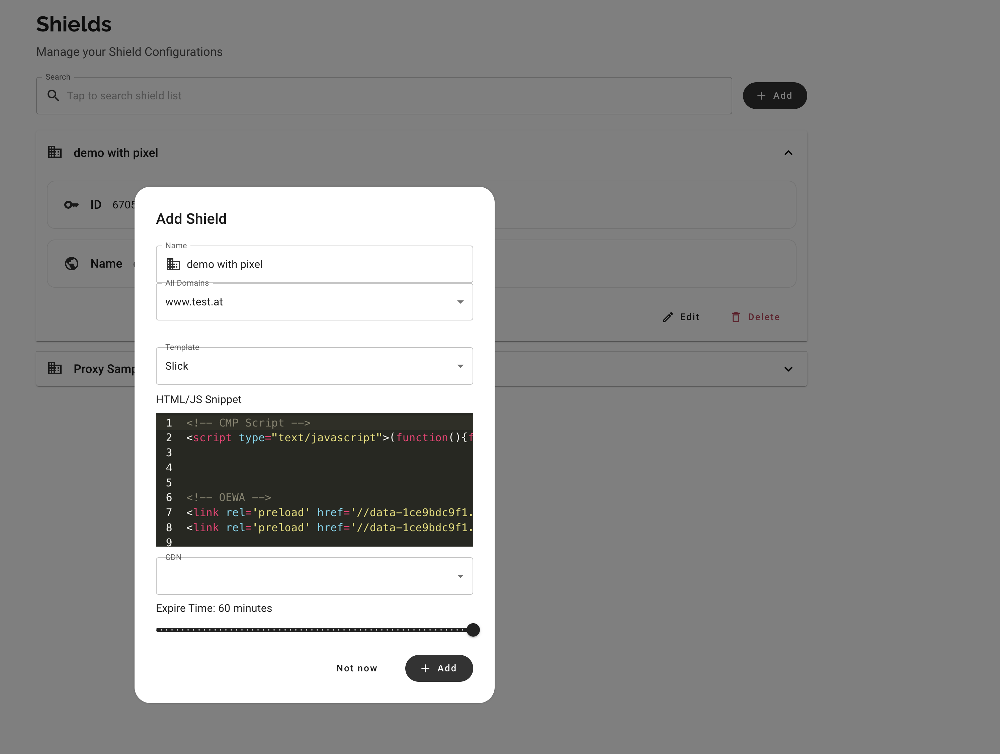
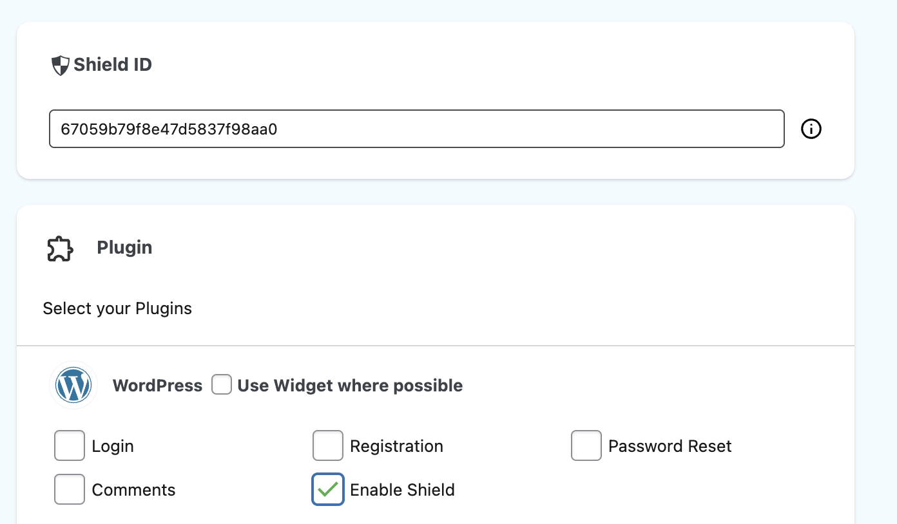

# Shield

> Early Beta

Shield is protecting your website from automated access, independently  from the backend/website behind.
users will need to verify that they are human, and will only then allowed to access your page.





# Configure the shield

Go into `Dashboard->Shields`  and click `+Add`

> Using the html snippet, you can add your tracking/analytics code




add a *Name*, and link it with one of your existing captcha.eu domains

# Enable Shield

since Shield intercepts all requests to your page you currently have the following options

## WordPress

get the latest version of the plugin, and enable shield in the settings
by adding a `shieldID`  and also checking the box at `Enable Shield`

> beware, this intercepts wordpress's stack to early terminate the request
> this way you get a really good protection, but for a real DDoS see below




## CDN
Shield works best when implemented at the CDN level - right now we offer the following options

### Caddy
using jwt-auth directly in Caddy, you can setup a reverse proxy. if that reverse proxy is run in some autoscaling environment
this is a cdn-grade ddos protection.

`Caddyfile` config:
```
{
	order jwtauth before basicauth
    http_port 880
    https_port 4443
    debug
}

www.mywebsite.com {
    @shield {
        not path /api/shield/*
    }
    @captcha_portal {
        path /api/shield/*
    }

	jwtauth @shield {
		sign_key base64-of-my-captcha-eu-website-private-key
		sign_alg HS256
		from_cookies cptst
	}
    handle_errors  401 {
	    redir /api/shield/MY-SITE-ID?targetURL={uri} /api/shield/MY-SITE-ID?targetURL={uri}
    }
	reverse_proxy @shield https://www.mywebsite.origin.com {
        header_up Host "www.mywebsite.com"
    }
    reverse_proxy @captcha_portal https://www.captcha.eu {
        header_up Host "www.captcha.eu"
    }
}
```

### Akamai
there is support for EdgeAuth integrated - for access please contact hello@captcha.eu

### Cloudfront
there is support for Lambda@Edge integrated - for access please contact hello@captcha.eu

### I don't have a CDN
if you don't have a CDN and cannot run Caddy/Proxy at your datacenter, and still would like to get a the best protection
contact us - we will find a solution.