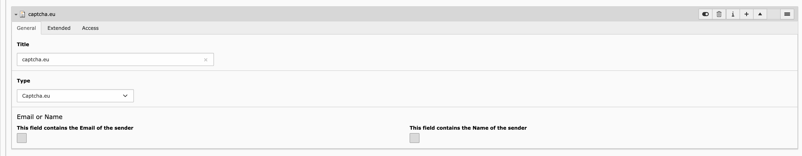

> as of now <b>only</b> powermail is supported in a beta fashion.
##  PowerMail <sup>beta<sup>

### Install
add the dependency
```sh
composer require captcha-eu/typo3-powermail
```

### Configure
go to <a href="https://www.captcha.eu/dashboard">captcha.eu dashboard</a>, signup and create a domain.

add keys as  TypoScript Constants:

```
plugin.tx_captchaeu.publickey = 6LdsBBUTAAAAAKMhI67inzeAvzBh5JdRRxlCwbTz
plugin.tx_captchaeu.restkey = 6LdsBBUTAAAAAKMhaaaainzeAvzBh5JdRRxlCwbyy
```

### Activate

Add a new Field "captcha.eu" to your form's where you'd like to have the protection.


the label and position of the field is irrelevant, it just needs to be in the form.


the field itself is invisible in the frontend.



### Notes and best practice

Be sure to have spamshield enabled in powermail (TypoScript setup):


```
plugin.tx_powermail.settings.setup.spamshield._enable = 1
```

Keep up to date if powermail recognize spam (TypoScript setup):

```
# Get an email if spam was recognized
plugin.tx_powermail.settings.setup.spamshield.email = spamreceiver@yourdomain.org

# Write to a logfile when spam was recognized
plugin.tx_powermail.settings.setup.spamshield.logfileLocation = typo3temp/logs/powermailSpam.log
```
