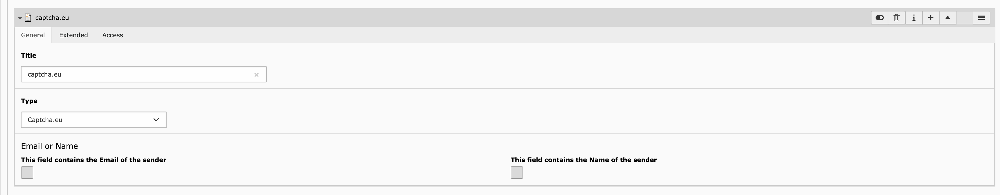
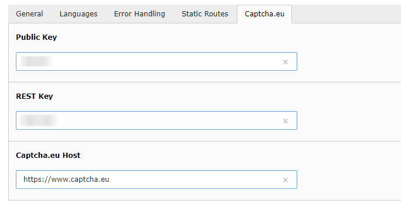
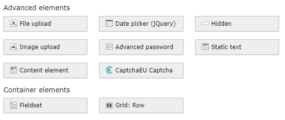
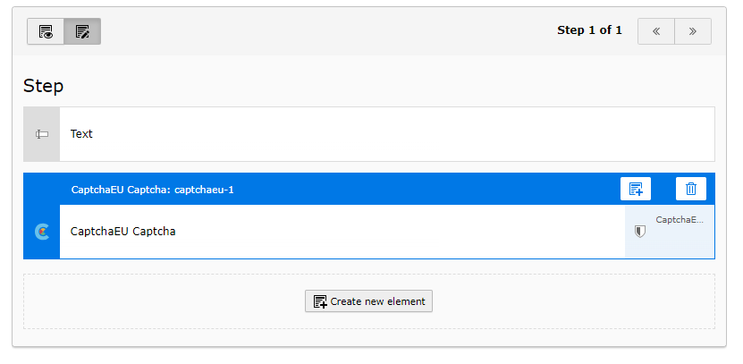
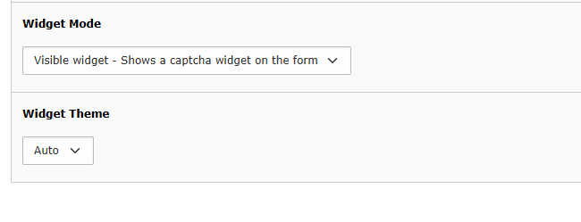

##  PowerMail 

### Install
add the dependency
```sh
composer require captcha-eu/typo3-powermail
```

### Configure
go to <a href="https://www.captcha.eu/dashboard">captcha.eu dashboard</a>, signup and create a domain.

add keys as  TypoScript Constants:

```
plugin.tx_captchaeu.publickey = 6LdsBBUTAAAAAKMhI67inzeAvzBh5JdRRxlCwbTz
plugin.tx_captchaeu.restkey = 6LdsBBUTAAAAAKMhaaaainzeAvzBh5JdRRxlCwbyy
```

### Activate

Add a new Field "captcha.eu" to your form's where you'd like to have the protection.


the label and position of the field is irrelevant, it just needs to be in the form.


by default, the field is invisible in the frontend.



### Widget mode
By default, captcha.eu runs in **invisible mode** and requires no visible interaction from the user. If you'd like to show a visible "I am human" widget instead, you can switch to **widget mode**.

Add these to your TypoScript Constants alongside your keys:

```
plugin.tx_captchaeu.mode = widget
plugin.tx_captchaeu.theme = light
```

- `mode`: `invisible` (default) or `widget`
- `theme`: `light`, `dark`, or `auto` (only used when `mode` is `widget`)

No other changes are needed - the same "captcha.eu" field you already added to your form will render as a visible widget instead of running invisibly.


### Notes and best practice

Be sure to have spamshield enabled in powermail (TypoScript setup):


```
plugin.tx_powermail.settings.setup.spamshield._enable = 1
plugin.tx_powermail.settings.setup.spamshield.methods.11.indication = 100
```

Keep up to date if powermail recognize spam (TypoScript setup):

```
# Get an email if spam was recognized
plugin.tx_powermail.settings.setup.spamshield.email = spamreceiver@yourdomain.org

# Write to a logfile when spam was recognized
plugin.tx_powermail.settings.setup.spamshield.logfileLocation = typo3temp/logs/powermailSpam.log
```

##  Form 

### Install
add the dependency
```bash
composer require captcha-eu/typo3
```

### Configuration
Go to <a href="https://www.captcha.eu/dashboard">captcha.eu dashboard</a>, signup and create a domain.

You will obtain a REST and Public-Key that you need to add in the backend.

<br />

In your TYPO3 CMS, go to `Sites Management -> Sites -> Captcha.eu` in order to enter your keys.



If you want to protect a form with Captcha.eu, just insert the Captcha.eu element listed under `Advanced Elements` in the form editor.



You will now see the Captcha.eu-Element inserted into you form.



After saving, Captcha.eu will now protect any submission.

### Widget mode
By default, captcha.eu runs in **invisible mode**. To show a visible "I am human" widget instead, switch to **widget mode** directly in the same `Sites Management -> Sites -> Captcha.eu` screen where you entered your keys:



- **Widget mode**: choose "Invisible mode" (default) or "Visible widget"
- **Widget theme**: choose Light, Dark, or Auto (only used when Widget mode is selected)

No changes to the form itself are needed - the same Captcha.eu element you inserted will render as a visible widget instead of running invisibly.

### Compatibility
 
| Version | TYPO3       | PHP         |
|---------|-------------|-------------|
| 2.x     | 12.4 - 14.x | 8.2 - 8.4   |
| 1.x     | 11.5 - 13.4 | 8.2 - 8.3   |
 
> **Note:** PHP 8.2 or higher is required on both the `2.x` and `1.x` branches. If you are on PHP 8.1 or lower, use the legacy TYPO3 9/10 branch below instead.

### TYPO3 &lt;11 or PHP&lt;8

to use the extension for FORMS on older TYPO3 (9,10) or older PHP (&lt;8) please use the special branch here:

<a href="https://github.com/captcha-eu/typo3/archive/refs/heads/typo3_9.5.zip">Here</a>


for composer systems use `"captcha-eu/typo3": "dev-typo3_9.5"`


