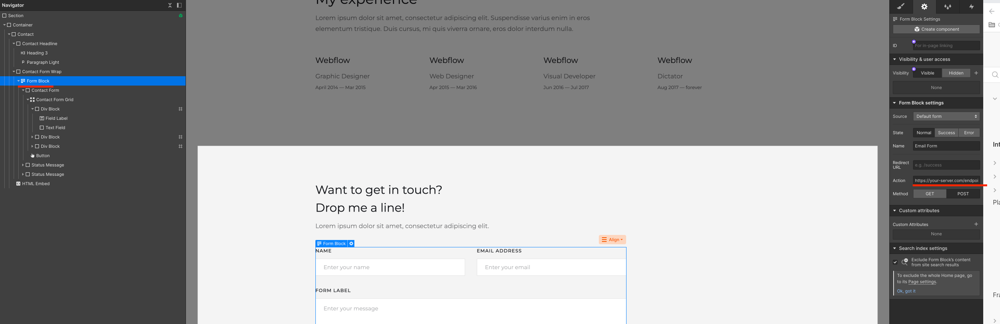
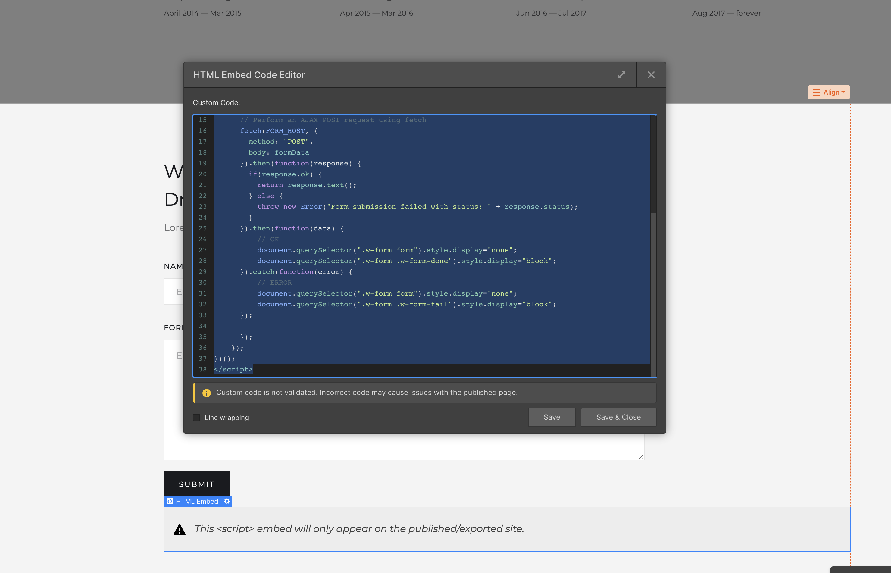

# Webflow

> This is experimental, since webflow does not allow custom backend code to be run on their servers, you need to deploy/run a tiny little helper php script, to run the validations


# Configure the page

inside webflow designer, find your form block, in the settings, configure the action to be `https://your-server.com/endpoint/index.php`





# Add HTML Snippet

below the "submit" button add a custom HTML Embed 



```js
<script src="https://www.captcha.eu/sdk.js"></script>
<script>
var FORM_HOST = "https://your-endpoint.com";
KROT.setup("PUBLIC SECRET");
// Scope
(() => {
	// Get a reference to the form
	var form = document.querySelector(".w-form form");
	form.addEventListener("submit", function(event) {
		event.preventDefault(); // Prevent the default form submission
		document.querySelector(".w-form form .button").disabled = true;
		KROT.getSolution().then((sol) => {
			var formData = new FormData(this); // Create a FormData object from the form
			formData.append("captcha_at_solution", JSON.stringify(sol));
			formData.append("page-id", document.getElementsByTagName("html")[0].getAttribute("data-wf-site"));
			// Perform an AJAX POST request using fetch
			fetch(FORM_HOST, {
				method: "POST",
				body: formData
			}).then(function(response) {
				if(response.ok) {
					return response.text();
				} else {
					throw new Error("Form submission failed with status: " + response.status);
				}
			}).then(function(data) {
				// OK
				document.querySelector(".w-form form").style.display = "none";
				document.querySelector(".w-form .w-form-done").style.display = "block";
			}).catch(function(error) {
				// ERROR
				document.querySelector(".w-form form").style.display = "none";
				document.querySelector(".w-form .w-form-fail").style.display = "block";
			});
		});
	});
})();
</script>

```


# Backend

since webflow as of now does not support custom server-side code.
here is an example, of how you could handle the validation+submit:


```php
<?php

$restKey = "YOUR REST KEY";
$formName = "Email Form";

// Return 403, and error message
function fail_request() {
    http_response_code(403);
    header("HTTP/1.1 403 Forbidden");    
    exit;
}
function checkSolution($solution) {
    $ch = curl_init("https://w19.captcha.at/validate");
    curl_setopt($ch, CURLOPT_POSTFIELDS, $solution);
    curl_setopt($ch, CURLOPT_HTTPHEADER, array('Content-Type: application/json', 'Rest-Key: ' . $restKey));
    curl_setopt($ch, CURLOPT_RETURNTRANSFER, true);
    $result = curl_exec($ch);
    curl_close($ch);

    $resultObject = json_decode($result);
    if ($resultObject->success) {
      return true;
    } else {
      return false;
    }
  }


header("Access-Control-Allow-Origin: *");

// check if solution is not existing
if(!isset($_POST["captcha_at_solution"]) || empty($_POST["captcha_at_solution"])) {
    fail_request();
}

$valid = checkSolution($_POST["captcha_at_solution"]);
if(!$valid) {
    fail_request();
}


$pageId = $_POST["page-id"];

// Remove from incomming payload
unset($_POST["captcha_at_solution"]);
unset($_POST["page-id"]);

// Captcha is valid, if we reach this point
// Call the original webflow endpoint, to "submit" the form
// ideally, you could send the email's directly from this part of the code

$curl = curl_init();

$data = array(
    'name' => $formName,
    'test' => 'false',
    'fields' => $_POST,
    'dolphin' => 'false',
);


$postFields = http_build_query($data);

curl_setopt_array($curl, array(
    CURLOPT_URL => 'https://webflow.com/api/v1/form/' . $pageId,
    CURLOPT_RETURNTRANSFER => true,
    CURLOPT_ENCODING => '',
    CURLOPT_MAXREDIRS => 10,
    CURLOPT_TIMEOUT => 0,
    CURLOPT_FOLLOWLOCATION => true,
    CURLOPT_HTTP_VERSION => CURL_HTTP_VERSION_1_1,
    CURLOPT_CUSTOMREQUEST => 'POST',
    CURLOPT_POSTFIELDS => $postFields,
    CURLOPT_HTTPHEADER => array(
        'authority: webflow.com',
        'accept: application/json, text/javascript, */*; q=0.01',
        'accept-language: de-DE,de;q=0.9,en-US;q=0.8,en;q=0.7,it;q=0.6,la;q=0.5,da;q=0.4',
        'cache-control: no-cache',
        'content-type: application/x-www-form-urlencoded; charset=UTF-8',
    ),
));

$response = curl_exec($curl);

curl_close($curl);

echo $response;
?>


```

