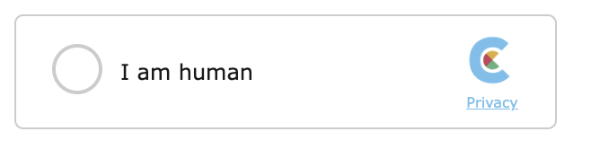
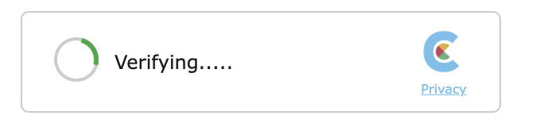
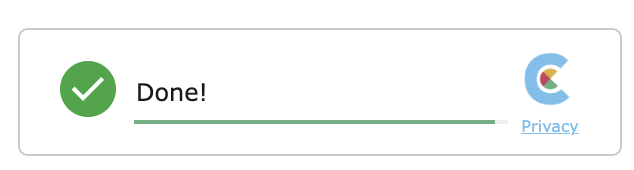

# Widget

for integration of a more visible way, to show the user that this page/form is protected with a captcha you might
want to use the widget.

# Integration

You need to add to your head

```html
<script type="text/javascript" src="https://www.captcha.eu/sdk.js" defer></script>
```

and then add the widget within your `<form></form>`


```html
<div id="you_can_choose_your_id" class="cpt_widget" data-key="YOUR_PUBLIC_KEY">
```

> the class `cpt_widget`  is important, all div's with that class will be auto initialized

initialize all widgets:

```js
<script>
KROT.init();
</script>
```


To validate - please see [Integration](/install) on how to validate the token on your backend/application, by default the payload is in the form-field named `captcha_at_hidden_field`


|                                                 |                                  |  |
| -------------------------------------------------------- | -------------------------------------- | ------- |
|                                    |  |       |


## Additional Widget options

| Attribute                                                | Values                                 | Description |
| -------------------------------------------------------- | -------------------------------------- | ------- |
| `data-field-selector`                                    | a selector for the target hidden field |  the final validation payload will be written into this dom element (usually a `<input type='hidden'>`), by default captcha creates a new one named: `captcha_at_hidden_field`     |
| `data-language-force`                                    | force specific laguage                 |  widget detecs language via browser, if you'd like to force one set it, possible values: `en`, `de`, `fr`, `ru`, `uk`, `zh`, `hr`, `sr`, `no`, `sv`, `lt`, `da`, `nl`, `it`, `es`    |
| `data-theme         `                                    | force theme                            |  by default the widget detect's OS based light/dark mode, you can force it, possible values: `dark`, `light`, `clean`   |


# Advanced Usage

to use the widget in advanced mode you can control rendering and get callbacks for states and solutions

> for usage with npm packages see [NPM](/npm) to get a `KROT` base instance

```js
<div id="myCustomDiv"></div>
<input type="hidden" id="captcha_at_solution">

<script>
    // initialize
    var cptTarget = document.querySelector("#myCustomDiv")

    KROT.init();
    KROT.setup("public key")
    KROT.WidgetV2.render(cptTarget)


    KROT.on("CPT_OK", function(e) {
      // Update the hidden field to be included in the POST request
      document.querySelector("#captcha_at_solution").value = JSON.stringify(e.detail);
    }, cptTarget)

    KROT.on("CPT_FAILED", function(e) {
      // captcha failed
      document.querySelector("#captcha_at_solution").value = "";
    }, cptTarget)
    KROT.on("CPT_EXPIRED", function(e) {
      // solved captcha has been expired
      document.querySelector("#captcha_at_solution").value = "";
    }, cptTarget)
</script>
```
