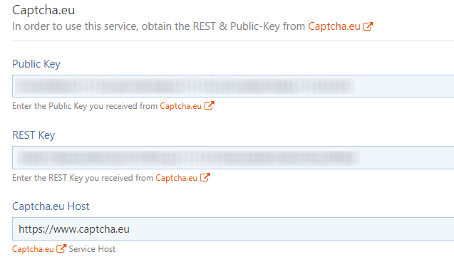
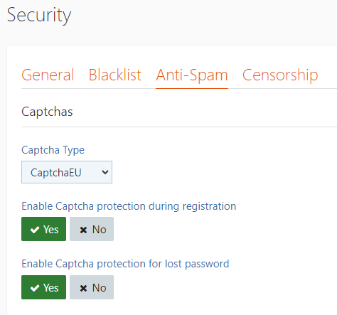

# WoltLab Suite™ Core

We provide a ready to use plugin for your WoltLab Suite™ Core installation. 

In order to use Captcha.eu, follow these steps:

## Download & Install

The extension can be downloaded in WoltLab Plugin-Store, installed out of the WoltLab ACP via StoreCode or uploaded directly as archive file.

### WoltLab Plugin-Store:

 - https://www.woltlab.com/pluginstore/file/7523-captcha-eu/

### Installation

In your ACP, navigate to `Configuration->Packages->Install Package`.

You can now either enter the StoreCode or upload the tar-archive via `Upload Package`.

## Signup at captcha.eu

Go to [www.captcha.eu/login](https://www.captcha.eu/login) and signup, your first **100 validations** are **free**.

After signup go to `domains` and add a new domain.

When done, you&apos;ll get the Rest-Key and Public Key, now head back to your WoltLab Suite™ Core ACP.

## Enter REST & Public-Key

Navigate to `Configuration->Security->Anti-Spam->Captcha.eu`.

Here you can enter your recently obtained REST & Public-Key.

## Enable Plugin

In order for the service to be activated, simply select `CaptchaEU` in the "Captcha Type" dropdown.

