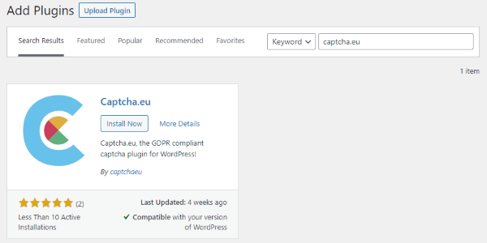
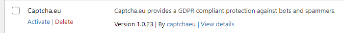
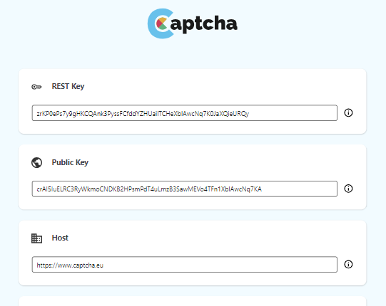
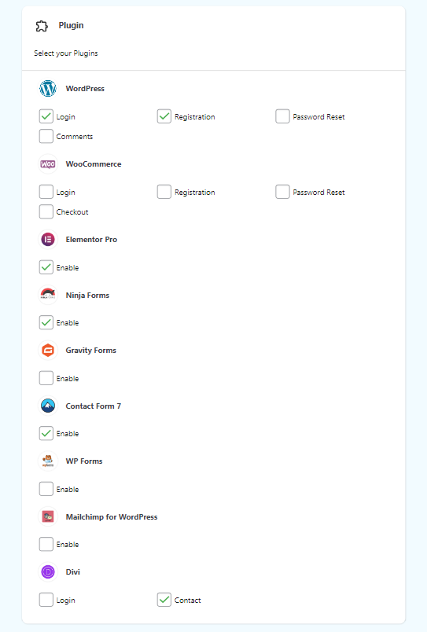

# WordPress

The Captcha-eu plugin is a powerful tool to protect your WordPress website from bots.

#### Here's how to set it up:

1. **Download the Plugin**: Navigate to the WordPress plugin directory and search for "captcha.eu". Download and install the plugin.

2. **Sign up for an Account**: Go to [www.captcha.eu/login](https://www.captcha.eu/login) and sign up for a captcha.eu account. Once you have signed up, log in to your account.

3. **Create Domains**: in the dashboard create the domain(s) you'd want to have, this can be any string and is not bound to the http domain itself, its an organizational unit.

4. **Activate the Plugin**: In your WordPress dashboard, go to "Plugins" and activate the Captcha-eu plugin or activate the plugin right after downloading it via plugin directory.

5. **Configure the Plugin**: In the Captcha-eu plugin settings, copy your API keys (public and rest-key) from the dashboard into the plugin's settings. This will enable communication between your website and the captcha.eu server.

6. **Enable Protection**: Enable the checkboxes next to the plugins you want to have captcha.eu enabled for. This will activate bot protection for the selected plugins.

**Congratulations**, you have now set up and configured the Captcha-eu plugin on your WordPress website for bot protection! 
If you encounter any issues or have any questions, please refer to our documentation or [contact](https://www.captcha.eu/contact) our support team.

##  WordFence Login Security

If you'd like to get early access to WFLS support please contact hello@captcha.eu or contact the support via www.captcha.eu/contact.
you can also use the live chat.

# Gravity Forms

there is some issues with "Gravity Forms" - you need to disable gravity forms honeypot feature.
it interferes with captcha.eu
