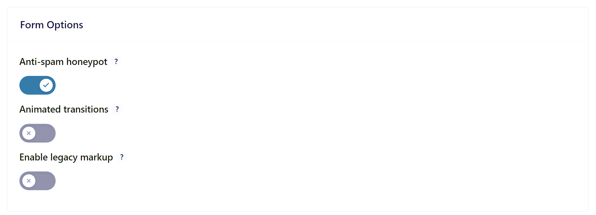
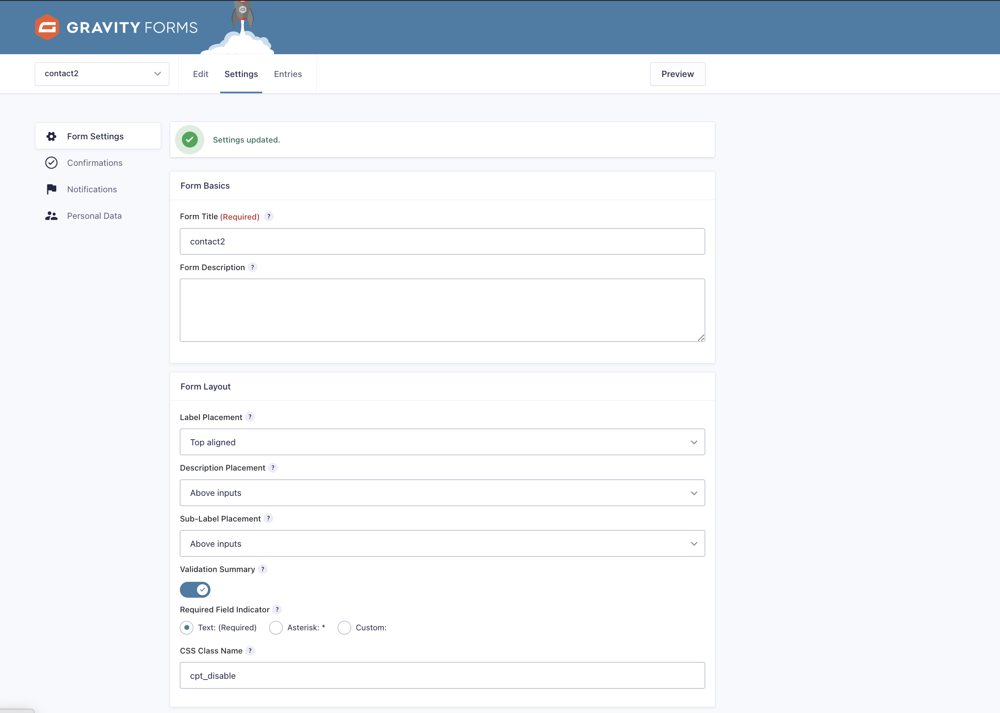

# WordPress Integration

The captcha.eu WordPress plugin provides seamless bot protection for your WordPress website with zero configuration complexity.

## Installation Guide

### Step 1: Install the Plugin
Search for "captcha.eu" in the WordPress plugin directory and install it directly from your WordPress admin panel.

### Step 2: Create Your Account
If you haven't already, [sign up for a captcha.eu account](https://www.captcha.eu/login). New accounts include 100 free verification requests for testing.

### Step 3: Set Up Domains
In your captcha.eu dashboard, create a domain entry for your WordPress site. **Important**: Enter your actual website domain (e.g., `example.com`) as this must match where your forms are hosted for security purposes.

### Step 4: Activate the Plugin
Go to **Plugins** in your WordPress admin and activate the captcha.eu plugin.

### Step 5: Configure API Keys
Navigate to the plugin settings and enter your API keys from the captcha.eu dashboard:
- **Public Key**: Used for client-side integration
- **REST Key**: Used for server-side validation (keep this secret!)

### Step 6: Enable Protection
Select which forms and plugins you want to protect by checking the appropriate boxes. This activates bot protection for your chosen components.

## Success! Your WordPress Site is Protected

Your WordPress website is now protected against bots. The plugin will automatically validate all form submissions and block suspicious traffic.

## Testing Your Integration

To verify everything is working:
1. Visit a protected form on your site
2. Check your captcha.eu dashboard for incoming requests
3. Review our [testing guide](testing.md) for comprehensive validation

## Need Help?

- **Plugin Issues**: Check the WordPress admin for error messages
- **API Problems**: Verify your keys in the dashboard
- **General Support**: [Contact our team](https://www.captcha.eu/contact) or use live chat

## Plugin Integrations

### WordFence Login Security

WordFence Login Security support is available in early access. Contact us for integration:
- **Email**: hello@captcha.eu
- **Support**: [Contact form](https://www.captcha.eu/contact)
- **Live Chat**: Available on our website

### Gravity Forms

**Important Configuration Required**

Gravity Forms' honeypot feature conflicts with captcha.eu. You must disable it for proper operation:

**Excluding Specific Forms**

To disable protection on specific forms, add the CSS class `cpt_disable` to the form:

