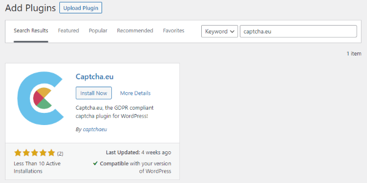
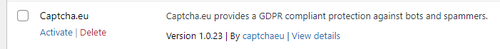
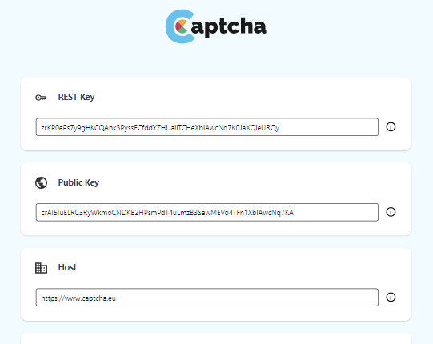
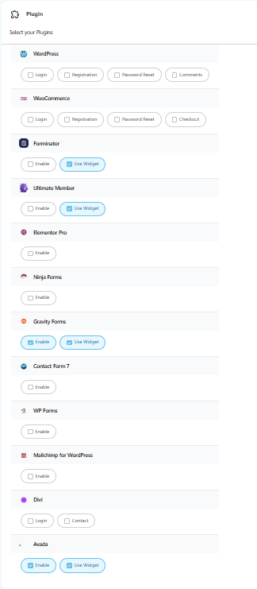
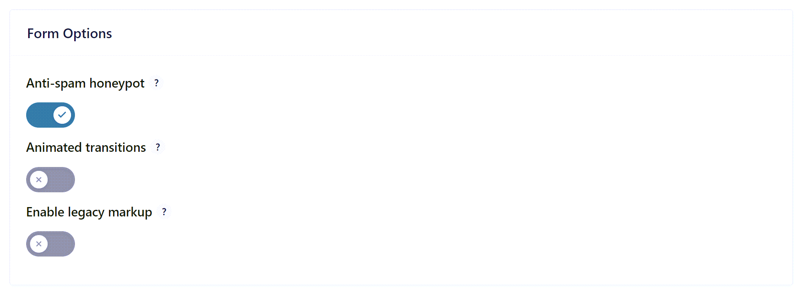
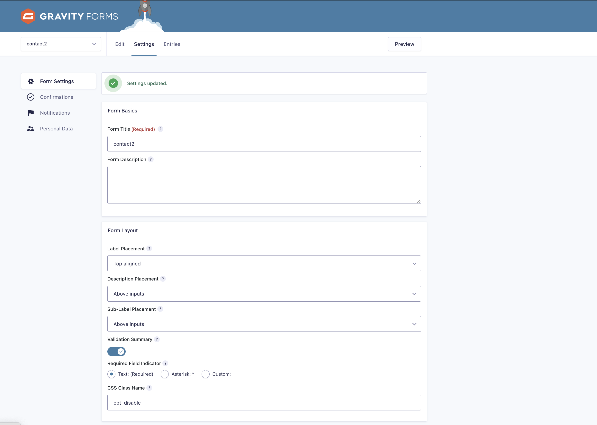

# WordPress Integration

The captcha.eu WordPress plugin provides seamless bot protection for your WordPress website with zero configuration complexity.

## Installation Guide

### Step 1: Install the Plugin
Search for "captcha.eu" in the WordPress plugin directory and install it directly from your WordPress admin panel.

### Step 2: Create Your Account
If you haven't already, [sign up for a captcha.eu account](https://www.captcha.eu/login). New accounts include 100 free verification requests for testing.

### Step 3: Set Up Domains
In your captcha.eu dashboard, create a domain entry for your WordPress site. **Important**: Enter your actual website domain (e.g., `example.com`) as this must match where your forms are hosted for security purposes.

### Step 4: Activate the Plugin
Go to **Plugins** in your WordPress admin and activate the captcha.eu plugin.

### Step 5: Configure API Keys
Navigate to the plugin settings and enter your API keys from the captcha.eu dashboard:
- **Public Key**: Used for client-side integration
- **REST Key**: Used for server-side validation (keep this secret!)

### Step 6: Enable Protection
Select which forms and plugins you want to protect by checking the appropriate boxes. This activates bot protection for your chosen components.

## Success! Your WordPress Site is Protected

Your WordPress website is now protected against bots. The plugin will automatically validate all form submissions and block suspicious traffic.

## Testing Your Integration

To verify everything is working:
1. Visit a protected form on your site
2. Check your captcha.eu dashboard for incoming requests
3. Review our [testing guide](testing.md) for comprehensive validation

## Need Help?

- **Plugin Issues**: Check the WordPress admin for error messages
- **API Problems**: Verify your keys in the dashboard
- **General Support**: [Contact our team](https://www.captcha.eu/contact) or use live chat

## Plugin Integrations

### Avada Forms

captcha.eu integrates directly with forms created using [Avada Form Builder](https://avada.com/feature/form-builder/). Protection is added automatically to Avada forms, including AJAX submissions; you do not need to add a captcha field in the form builder.

**Enable Avada Protection**

1. Make sure Avada and a captcha.eu plugin version that includes the Avada integration are installed and active.
2. In WordPress admin, go to **Captcha > Settings**.
3. Under **Plugin > Avada**, select one protection mode:
   - **Enable**: Uses invisible protection and validates the submission in the background.
   - **Use Widget**: Adds a visible captcha.eu widget before the form's submit button.
4. Click **Save Changes**.
5. Open an Avada form on your website, submit a test entry, and confirm that the request appears in your captcha.eu dashboard.

Select only one Avada mode. The selected mode applies to all forms built with Avada Form Builder.

**Troubleshooting**

- If Avada is not listed in the plugin settings, update captcha.eu to the latest version.
- If a form is not protected, confirm that it was created with Avada Form Builder rather than a third-party form plugin embedded in an Avada layout.
- After changing the integration mode, clear any WordPress page, JavaScript optimization, and CDN caches before testing again.
- If submissions fail with `Captcha.eu failed`, verify the public key, REST key, and configured domain.

### WordFence Login Security

WordFence Login Security support is available in early access. Contact us for integration:
- **Email**: hello@captcha.eu
- **Support**: [Contact form](https://www.captcha.eu/contact)
- **Live Chat**: Available on our website

### Gravity Forms

**Important Configuration Required**

Gravity Forms' honeypot feature conflicts with captcha.eu. You must disable it for proper operation:

**Excluding Specific Forms**

To disable protection on specific forms, add the CSS class `cpt_disable` to the form:

### Avada

captcha.eu supports forms created with the **Avada Form Builder**.

Two modes are available:

**Enable** – Automatically intercepts form submission and validates the captcha in the background. No visible widget is shown to the user.

**Use Widget** – Displays the "Ich bin ein Mensch" widget directly on the form. The submit button remains disabled until the user completes the captcha check.

To enable protection, go to the captcha.eu plugin settings and check **Enable** and/or **Use Widget** under the Avada section.

